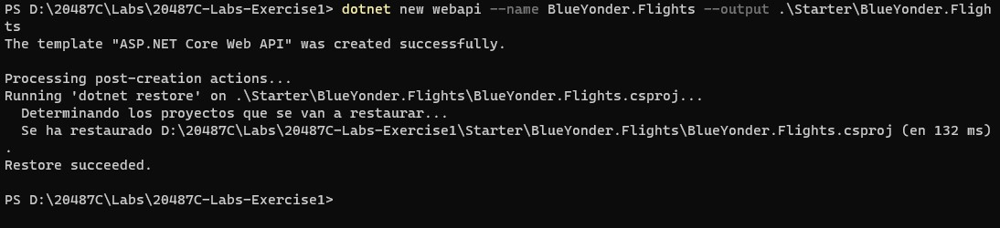

# Module 1: Overview of Service and Cloud Technologies

# Lab: Exploring the Work Environment

1. **Nombres y apellidos:** Francisco Javier Moreno Quevedo
2. **Fecha:** 17/12/2020
3. **Resumen del Ejercicio:**  Crear una aplicación NET Core Web API desde la linea de comandos con Visual Studio Core
4. **Dificultad o problemas presentados y como se resolvieron:** Ninguna


- Ejercicio 1: Creating an ASP.NET Core Project

  - Desde la linea de comandos ejecutar:

  ```cs
     dotnet new webapi --name BlueYonder.Flights --output .\Starter\BlueYonder.Flights
  ```

  

  

